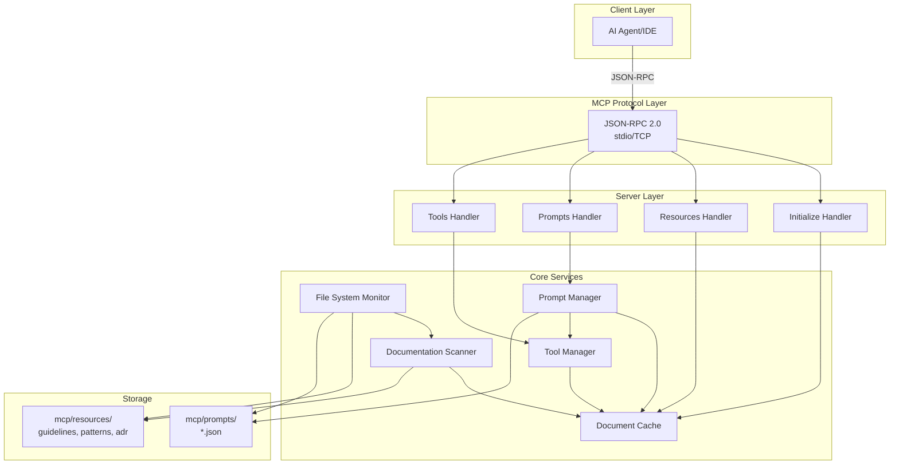
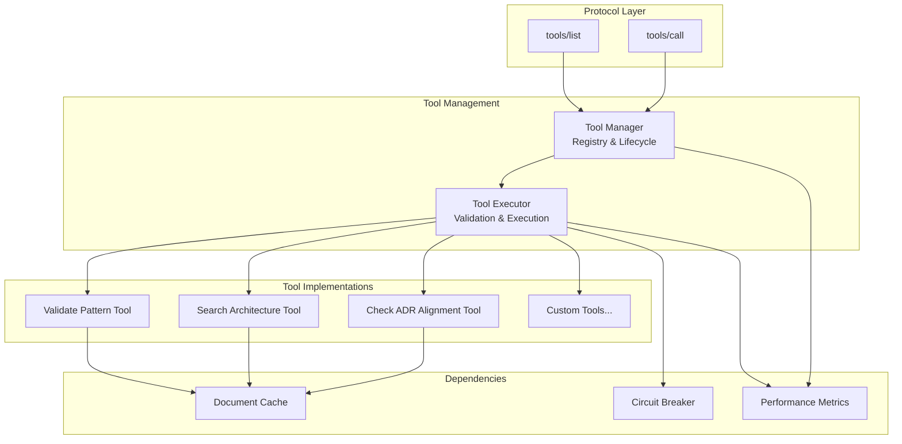
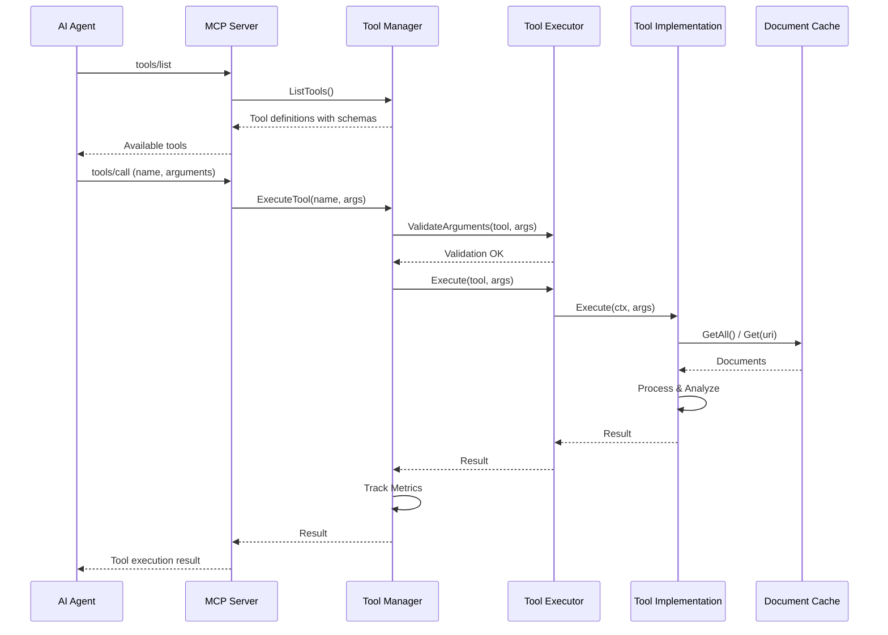
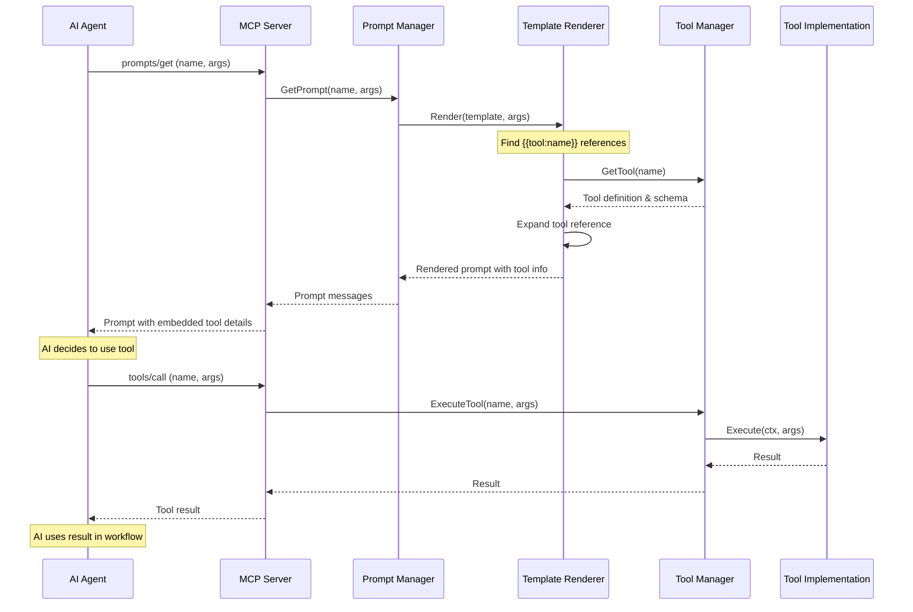
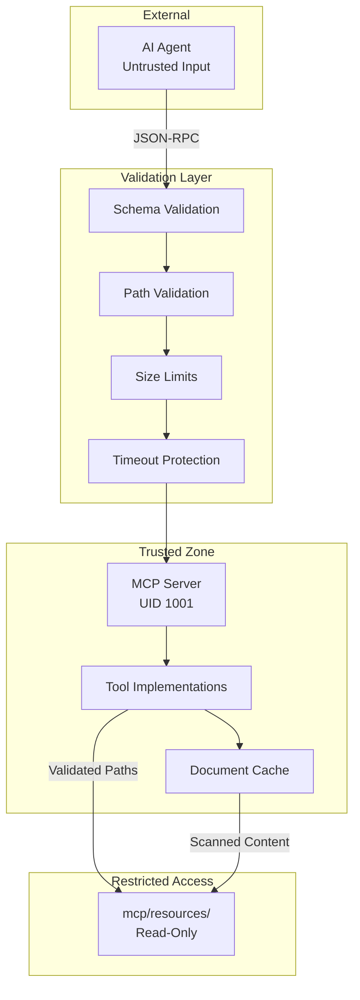

# Architecture Overview

This document provides architectural diagrams for the MCP Architecture Service, including the tools subsystem.

## System Architecture



## Tools Subsystem Architecture



## Tool Execution Flow



## Prompt-Tool Integration Flow



## Component Responsibilities

### MCP Server (`internal/server/`)
- Protocol message routing
- Request/response handling
- Error conversion to MCP format
- Capability negotiation

### Tool Manager (`pkg/tools/manager.go`)
- Tool registration and discovery
- Tool lookup by name
- Performance metrics tracking
- Coordination with executor

### Tool Executor (`pkg/tools/executor.go`)
- Argument validation against JSON schema
- Timeout enforcement (10s default)
- Security checks (path validation, size limits)
- Error handling and sanitization

### Tool Implementations (`pkg/tools/*.go`)
- Self-contained functionality
- Cache-based data access
- Structured result generation
- Context-aware execution

### Document Cache (`pkg/cache/`)
- Thread-safe in-memory storage
- Fast document lookup by URI
- Automatic invalidation on file changes
- Shared across all tools

### Prompt Manager (`pkg/prompts/`)
- Prompt loading and validation
- Template rendering with tool references
- Argument substitution
- Resource embedding

## Data Flow

### Resource Access
```
File System → Scanner → Cache → Tools → Results
     ↓
  Monitor (fsnotify)
     ↓
  Auto-refresh
```

### Tool Invocation
```
AI Agent → JSON-RPC → Handler → Manager → Executor → Tool → Cache
                                    ↓
                              Metrics Tracking
                                    ↓
                              Circuit Breaker
```

### Prompt-Tool Workflow
```
AI Agent → Prompt Request → Template Renderer → Tool Reference Expansion
                                                        ↓
                                                  Tool Definitions
                                                        ↓
AI Agent ← Rendered Prompt ← Embedded Tool Info ←──────┘
    ↓
Tool Invocation → Tool Execution → Result → Workflow Continuation
```

## Security Boundaries



## Performance Optimizations

### Caching Strategy
- Documents cached in memory at startup
- Hot-reload on file system changes (< 2s)
- Thread-safe concurrent access with RWMutex
- No disk I/O during tool execution

### Concurrent Execution
- Multiple tools can execute simultaneously
- Each tool has independent context and timeout
- Shared cache with read-write locking
- Circuit breaker per tool to prevent cascading failures

### Metrics Collection
- Tool invocation counts by name
- Execution time tracking
- Failure rate monitoring
- Timeout detection

## Extensibility Points

### Adding New Tools
1. Implement `Tool` interface in `pkg/tools/`
2. Register in `initializeToolsSystem()`
3. Add tests in `pkg/tools/*_test.go`
4. Document in README and tools guide

### Adding New Prompt Templates
1. Create JSON file in `mcp/prompts/`
2. Use `{{tool:name}}` syntax for tool references
3. Auto-discovered by Prompt Manager
4. Hot-reloaded on file changes

### Custom Validation Logic
1. Extend Tool implementations
2. Add custom schema constraints
3. Implement domain-specific checks
4. Return structured violation reports

## Deployment Architecture

```mermaid
graph TB
    subgraph "Container"
        SERVER[MCP Server Process<br/>Non-root UID 1001]
        RESOURCES[/mcp/resources<br/>Read-Only Mount]
        PROMPTS[/mcp/prompts<br/>Read-Only Mount]
    end
    
    subgraph "Host System"
        DOCS[Documentation Files]
        IDE[IDE/AI Agent]
    end
    
    DOCS -->|Volume Mount| RESOURCES
    DOCS -->|Volume Mount| PROMPTS
    IDE -->|stdio/TCP| SERVER
    
    SERVER -->|Read| RESOURCES
    SERVER -->|Read| PROMPTS
```

### Container Constraints
- Alpine Linux base image
- Non-root user (UID 1001)
- Read-only root filesystem
- No network listeners (stdio only)
- Resource limits: 256M memory, 0.2 CPU
- Static binary (CGO disabled)
